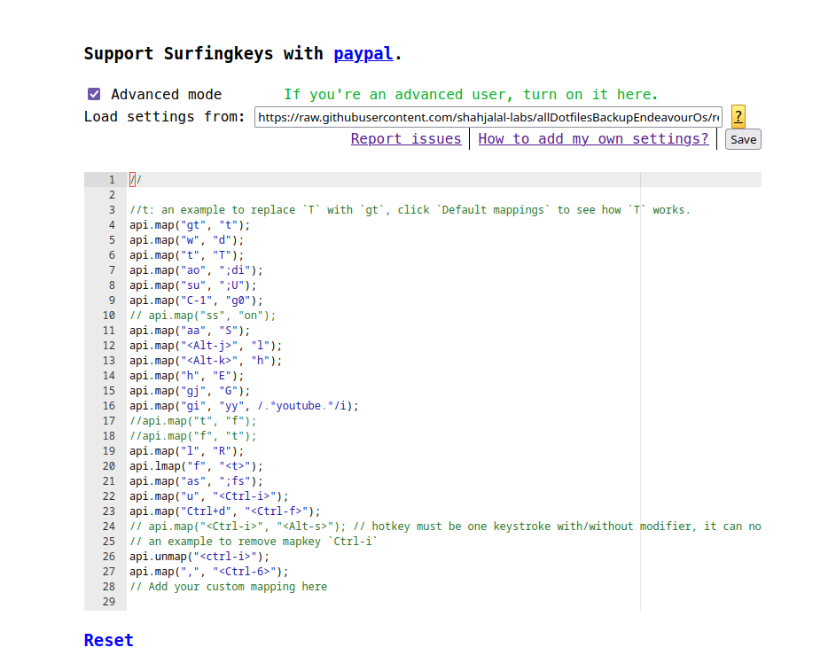
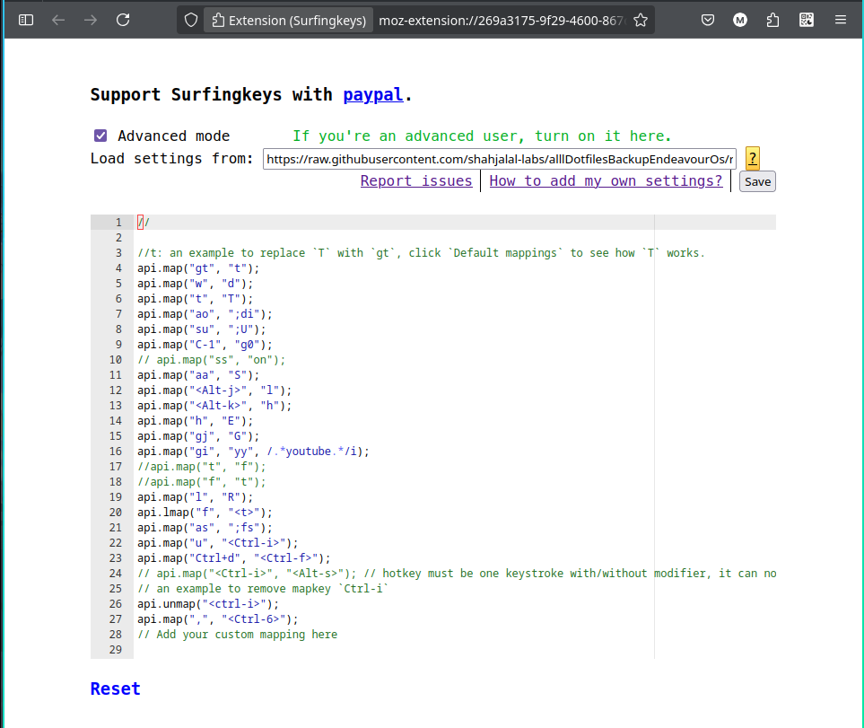

> ⚙️ **This is a customized configuration for the [Surfingkeys](https://github.com/brookhong/Surfingkeys) browser extension**, tailored for my personal workflow and productivity needs.

While originally crafted for personal use, **anyone can benefit** from this setup to:

- 🚫 Fully replace mouse usage
- ⚡ Streamline daily browsing tasks
- 🤖 Automate workflows
- 🧭 Navigate the web efficiently using keyboard shortcuts

> 🙏 **Full credit** to the original creator: [brookhong/Surfingkeys](https://github.com/brookhong/Surfingkeys)
> 🧠 **Surfingkeys is a vast and powerful tool** — what I've shared here is just the tip of the iceberg.

There’s so much more you can explore:

- 🧩 Build your own custom workflows
- 🛠️ Extend it using the Surfingkeys API
- ⚙️ Create fully automated, keyboard-driven browsing experiences

> ✨ I must admit — this configuration is **only a glimpse** of what's possible. **With creativity and code, you can turn Surfingkeys into your ultimate browser automation engine.**

# 🌟 surfingKeys

## 📂 Project Information

| 📝 **Detail**           | 📌 **Value**                                                                                                         |
| ----------------------- | -------------------------------------------------------------------------------------------------------------------- |
| 🔗 **GitHub URL**       | [https://github.com/shahjalal-labs/surfingKeys](https://github.com/shahjalal-labs/surfingKeys)                       |
| 🌐 **Live Site**        | [http://shahjalal-mern.surge.sh](http://shahjalal-mern.surge.sh)                                                     |
| 💻 **Portfolio GitHub** | [https://github.com/shahjalal-labs/shahjalal-portfolio-v2](https://github.com/shahjalal-labs/shahjalal-portfolio-v2) |
| 🌐 **Portfolio Live**   | [http://shahjalal-mern.surge.sh](http://shahjalal-mern.surge.sh)                                                     |
| 📁 **Directory**        | `/run/media/sj/developer/surfingKeys`                                                                                |
| 👤 **Username**         | `sj`                                                                                                                 |
| 📅 **Created On**       | `02/07/2025 10:43 অপরাহ্ণ বুধ GMT+6`                                                                                 |
| 📍 **Location**         | Sharifpur, Gazipur, Dhaka                                                                                            |
| 💼 **LinkedIn**         | [https://www.linkedin.com/in/md-sj-825bb4341/](https://www.linkedin.com/in/md-sj-825bb4341/)                         |
| 📘 **Facebook**         | [https://www.facebook.com/profile.php?id=61556383702555](https://www.facebook.com/profile.php?id=61556383702555)     |
| ▶️ **YouTube**          | [https://www.youtube.com/@muhommodshahjalal9811](https://www.youtube.com/@muhommodshahjalal9811)                     |

# 🚀 SurfingKeys Modular Config

A blazing-fast, deeply modular, and developer-friendly configuration for the Surfingkeys Chrome extension. This setup is designed to speed up your daily browsing and development workflows with smart keybindings, productivity shortcuts, clipboard automation, and contextual tools for GitHub, YouTube, PH courses, and more.

---

## ✨ Features & Keybindings

> Organized by category and grouped by module. Each binding includes a shortcut, description, and relevant usage context.

---

### 🗺️ Navigation & Default Remappings (`defaultRemapped.js`)

| 🔑 Key   | 📌 Description                                      |
| -------- | --------------------------------------------------- |
| `gt`     | recent used tabs in omnibar                         |
| `w`      | scroll down half page                               |
| `t`      | hints letter to switch tab                          |
| `ao`     | download image with hints                           |
| `g0`     | Go to first tab (`g0`)                              |
| `aa`     | go back in history                                  |
| `j`      | scroll down                                         |
| `k`      | scroll up                                           |
| `h`, `l` | swith to the left tab, l for swith to the right tab |
| `gj`     | Scroll to bottom (`G`)                              |
| `gg`     | Scroll to top                                       |
| `gi`     | focus to the first input field                      |
| `i`      | focus to the input field                            |
| `f` )    | Local hint modes for click to url                   |
| `as`     | change scroll focus                                 |
| `u`      | scroll up half page                                 |
| `,`      | Switch to last used tab (`<Ctrl-6>`)                |

---

### 🧑‍💻 GitHub Utilities (`github.js`)

| 🔑 Key  | 📌 Description                                 |
| ------- | ---------------------------------------------- |
| `gr`    | Open GitHub repositories page                  |
| `gn`    | Create a new GitHub repository                 |
| `ga`    | Smart repo copier (works on user page or repo) |
| `<Esc>` | Exit copier loop (when `ga` is active)         |
| `gl`    | Copy GitHub `username/repo` from current URL   |

---

### 🌗 Theme & Appearance (`settings/theme.js`)

| 🔑 Key | 📌 Description                   |
| ------ | -------------------------------- |
| `ck`   | Toggle dark mode (CSS inversion) |

🎨 Custom theme is defined with Catppuccin-like colors for text, backgrounds, and focused hints.

---

### 🧠 Settings & Preferences (`settings/settings.js`)

- Custom hint characters: `"asdjkluiopwerm,nhgzxcvq'"`
- Emoji start indicators enabled (`startToShowEmoji = 1`)

---

### 🧭 Openers: Quick Link Launchers (`opener/*.js`)

#### 🌐 General Openers (`opener.js`)

| 🔑 Key | 📌 Opens                  |
| ------ | ------------------------- |
| `ad`   | Your Dotfiles GitHub repo |
| `ay`   | YouTube homepage          |
| `sq`   | Quran.com                 |
| `sb`   | Blank page                |

#### 🤖 AI Tools (`aiOpener.js`)

| 🔑 Key | 📌 Opens / Action                        |
| ------ | ---------------------------------------- |
| `sc`   | ChatGPT with logging in console loop     |
| `ax`   | Perplexity AI (current tab or new)       |
| `gh`   | Gemini AI                                |
| `ah`   | DeepAI image dashboard                   |
| `al`   | Claude AI new tab                        |
| `am`   | Claude AI `/new` if already on claude.ai |

#### 🎯 MERN Dev Tools (`mernOpener.js`)

| 🔑 Key | 📌 Opens                 |
| ------ | ------------------------ |
| `cd`   | DaisyUI Vite docs        |
| `at`   | TailwindCSS Vite install |
| `sl`   | Localhost:5173           |

#### 📱 Social Tools (`socialOpener.js`)

| 🔑 Key | 📌 Opens                          |
| ------ | --------------------------------- |
| `sf`   | Facebook                          |
| `sa`   | Gmail                             |
| `sm`   | WhatsApp Web                      |
| `and`  | Discord EJP session announcements |
| `anz`  | Zoom Join/Profile page            |

#### 🧑‍🎓 Programming Hero Course Links (`phOpener.js`)

| 🔑 Key | 📌 Opens (PH-related)             |
| ------ | --------------------------------- |
| `pso`  | Scribble project overview (L1B10) |
| `pa,`  | PH Help Desk                      |
| `sn`   | PH GitHub repos                   |
| `s1`   | Facebook Group Level 1            |
| `si`   | L2B4 RTK blogs loading module     |
| `sk`   | L2B4 course outline               |
| `ae`   | Conceptual L1 B10                 |
| `ac`   | Conceptual L1 B11                 |
| `sr`   | Redux recap project setup         |
| `sp`   | Next-level prerequisites L2B4     |
| `s2`   | Facebook Group Level 2            |
| `s4`   | TypeScript Module 2 (L2B4)        |
| `ai`   | Level1 Batch 11 Module Summary    |
| `ak`   | L1B11 Course Outline              |
| `aj`   | Facebook Support Group (L1B11)    |

#### 🕌 Islamic Resources (`islamicOpener.js`)

| 🔑 Key | 📌 Opens                |
| ------ | ----------------------- |
| `sj`   | YouTube Wedding Nasheed |

---

### 🖼️ Image Yank Tools (`imgYank.js`)

| 🔑 Key | 📌 Description                               |
| ------ | -------------------------------------------- |
| `ci`   | Copy URL of hovered/focused image            |
| `cl`   | Loop: copy multiple image URLs with hints    |
| `cj`   | Copy single image using hint                 |
| `cm`   | Copy image as Markdown (e.g., ``) |

---

#### For general users:

just copy the `surfingkeys.bundle.js` file path and paste it in the advanced mode load file option:
generally the path is: `https://raw.githubusercontent.com/shahjalal-labs/surfingKeys/refs/heads/main/surfingkeys.bundle.js`


### For developers who want to know how to use modular SurfingKeys and configure like his own

## 🚀 Getting Started

This project provides a modular Surfingkeys configuration, bundled into a single file using **ESBuild** for easy maintenance and fast loading.

---

## 🧩 Clone the Project

Start by cloning the repository to your local system:

````bash
git clone https://github.com/shahjalal-labs/surfingKeys.git
cd surfingKeys

## 🛠️ Build & Apply Instructions

### 🧱 Build with ESBuild

Ensure you have Bun installed. If not:
```curl -fsSL https://bun.sh/install | bash
```
Run the following command using Bun to bundle all your modular files:

```bash
bun run build
````

This will generate a single bundled output file:

```
surfingkeys.bundle.js

```

## 🌐 Step 2: Use the Bundled File in Your Browser

You have **two options** to apply the configuration inside the Surfingkeys extension:

---

### 🅰️ Option A: 🔗 Use GitHub Raw File (Recommended)

> ✅ Works in **Chrome** and **Firefox**

This is the cleanest, most portable method—using your GitHub-hosted bundle.

#### 🧭 Steps:

1. ✅ Ensure all permissions are enabled in the **Surfingkeys extension settings**:

   - ☑️ Allow access to file URLs
   - ☑️ Allow on all websites
   - ☑️ Enable extension

2. 🔧 Enter **Advanced Mode**:

   - Press `;e` on any webpage to enter Surfingkeys' configuration editor
   - Click `Advanced Mode` to switch to raw URL input mode

3. 🌐 Paste your GitHub raw bundle URL in the input field: `https://raw.githubusercontent.com/your-username/surfingKeys/main/surfingkeys.bundle.js`

> 🔁 Your config will auto-fetch from this path every time the browser loads!

4. 🧪 Click **Save**, then refresh the browser or reopen tabs.

---

### 🅱️ Option B: 📁 Use Local File (Chrome Only) ⚠️

> ❌ Not supported in **Firefox** due to browser restrictions on local file access

If you'd prefer using your local bundled file:

#### 🛠 Steps:

1. Run the build:

```bash
bun run build


1. Get the **absolute path** of the bundled output file, for example:
`/home/yourusername/surfingKeys/surfingkeys.bundle.js`


2. Open any tab and press `;e` to launch the Surfingkeys **configuration editor**

3. Click **Advanced Mode**

4. Paste the `file://` path directly into the input box:



5. ✅ Click **Save** and reload any tabs to apply

> ⚠️ This method **requires** that **"Allow access to file URLs"** is enabled in the Surfingkeys extension settings

---


> ✅ Works in **all browsers** (Chrome & Firefox)

If you're not using Advanced Mode or want full control over the code:

#### ✂️ Steps:

1. Open the bundled file:

`surfingkeys.bundle.js`
```

2. Copy **all the content**

3. Go to:
   
   pressing by `;e` on any https://webpage

4. Paste the entire content into the **configuration editor box**

5. ✅ Click **Save**

6. 🔁 Refresh your browser or tab to apply the changes

---

### 🔐 Permissions Checklist

Ensure these are enabled for the Surfingkeys extension:

| Setting                   | ✅ Chrome |     ⚠️ Firefox     |
| ------------------------- | :-------: | :----------------: |
| Allow access to file URLs |    ☑️     | ❌ (not supported) |
| Allow on all websites     |    ☑️     |         ☑️         |
| Extension enabled         |    ☑️     |         ☑️         |

---

### 🧠 Pro Tip

Use a **GitHub raw URL** in Advanced Mode to auto-load your config from anywhere:
`https://raw.githubusercontent.com/your-username/surfingKeys/main/surfingkeys.bundle.js`

````
---

## 🤝 Contributing

We welcome all contributions to improve and expand this Surfingkeys configuration project!

### 📋 How to Contribute

1. **Fork** the repository on GitHub
2. **Clone** your fork locally:

   ```bash
   git clone https://github.com/your-username/surfingKeys.git
---
then move bro...
### `Developer info:`


> 🚀
> 🧠
````
